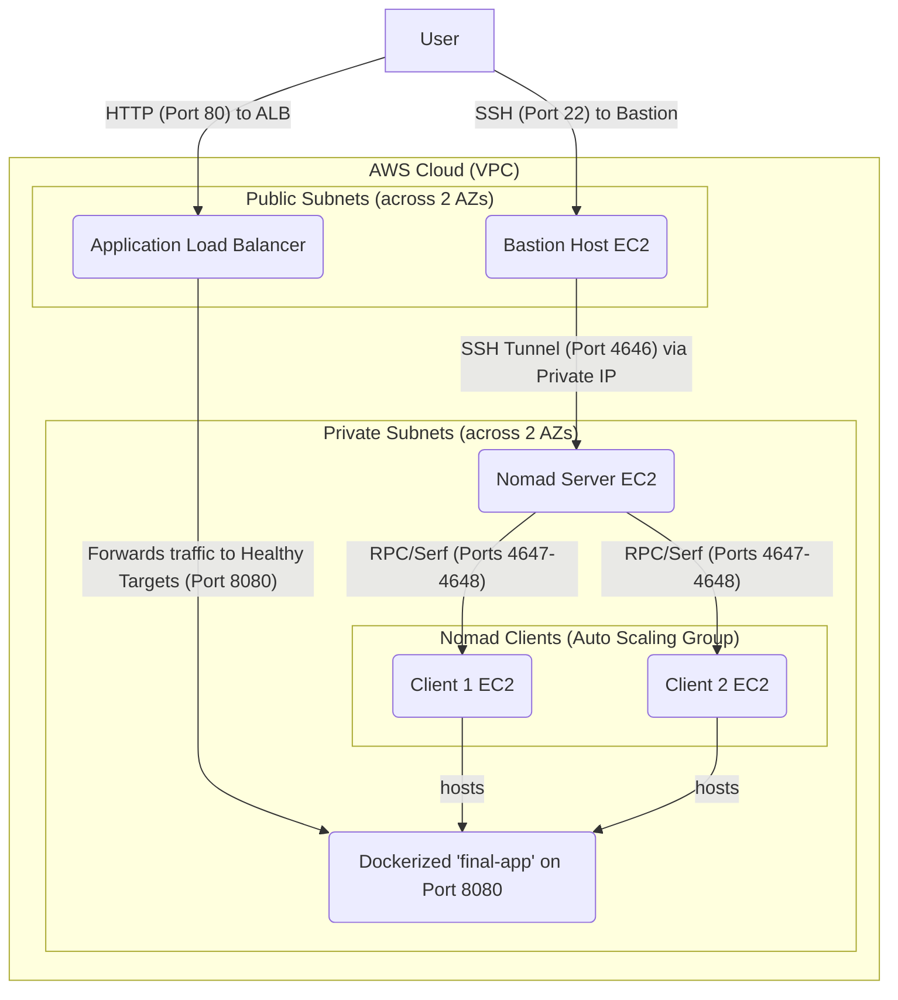

# MLOps Engineer Test Task: Secure and Scalable Nomad Cluster on AWS

This repository contains the complete Infrastructure as Code (IaC) solution for deploying a secure, scalable, and resilient HashiCorp Nomad cluster on Amazon Web Services (AWS) using Terraform.

This project fulfills all core requirements of the MLOps Engineer test task, demonstrating proficiency in provisioning distributed systems, managing secure networking, and applying infrastructure best practices.

## Table of Contents

- [Architecture and Design Choices](#architecture-and-design-choices)
- [Prerequisites](#prerequisites)
- [Deployment Instructions](#deployment-instructions)
- [Accessing the Cluster and Application](#accessing-the-cluster-and-application)
- [Scaling the Cluster](#scaling-the-cluster)
- [Cleanup](#cleanup)
- [File Structure](#file-structure)

## Architecture and Design Choices

The infrastructure is designed with a strong focus on security, scalability, and maintainability, adhering to modern IaC principles.

### Architectural Diagram



### Core Design Principles

*   **Infrastructure as Code (IaC):** The entire infrastructure is defined declaratively using Terraform. This ensures a repeatable, version-controlled, and automated deployment process. The code is structured into reusable modules (`networking`, `security`, `compute`) for clarity and maintainability.

*   **Security by Default:**
    *   **Network Isolation:** A custom Virtual Private Cloud (VPC) creates a logically isolated network. All core cluster components (Nomad server and clients) are placed in **private subnets**, which do not have direct internet access, protecting them from external threats.
    *   **Secure Access:** A **bastion host** (or jump box) is deployed in a public subnet to act as a single, hardened entry point for administrative access. All SSH traffic to the cluster must pass through this host. The Nomad UI is accessed via a secure SSH tunnel, ensuring it is never exposed to the public internet.
    *   **Principle of Least Privilege:** AWS Security Groups are used as a stateful firewall for every component. Rules are configured to only allow the minimum necessary traffic between resources (e.g., only the ALB can send traffic to the clients on the application port).

*   **Scalability and Resilience:**
    *   **High Availability:** The networking infrastructure (VPC, subnets) is deployed across **two Availability Zones (AZs)**. This ensures that the cluster can withstand a failure in a single AWS data center.
    *   **Auto Scaling Clients:** The Nomad client nodes are managed by an **Auto Scaling Group (ASG)**. This allows for simple, declarative scaling of the cluster's compute capacity. To increase capacity, one only needs to change a single variable (`client_nodes_count`) in the Terraform configuration. The ASG also ensures that if a client instance fails, a new one is automatically launched to replace it, maintaining the desired capacity.
    *   **Load Balancing:** An **Application Load Balancer (ALB)** is placed in the public subnets to distribute incoming user traffic across the healthy Nomad clients running the application. It automatically detects and routes traffic away from unhealthy instances.

*   **Workload Deployment:**
    *   The sample workload is a containerized web application deployed via a Nomad job file. This demonstrates the cluster's primary function of orchestrating and running tasks. The final application (`final-app.nomad.hcl`) uses a stable Docker image (`hashicorp/http-echo`) to act as a reliable web server, which is ideal for integration with the ALB's health checks.

## Prerequisites

Before you begin, ensure you have the following:

1.  **An AWS Account** with programmatic access (Access Key ID and Secret Access Key).
2.  **[Terraform](https://learn.hashicorp.com/tutorials/terraform/install-cli)** (version 1.0.0+) installed on your local machine.
3.  **[AWS CLI](https://aws.amazon.com/cli/)** installed and configured (run `aws configure`).
4.  **An AWS EC2 Key Pair** created in your target AWS region (e.g., `us-east-1`). You must have the private key file (`.pem`) saved on your machine.
5.  **(Windows Users)** A modern terminal like **PowerShell** or a tool like **PuTTY**.

## Deployment Instructions

1.  **Clone the Repository:**
    ```bash
    git clone <your-repo-url>
    cd <repo-name>
    ```

2.  **Configure Your Deployment:**
    Create a file named `terraform.tfvars` in the root of the project. **This file should not be committed to Git.** Copy the contents of `terraform.tfvars.example` into it and replace the placeholder values.

    ```terraform
    # terraform.tfvars

    # The AWS region to deploy the infrastructure in.
    aws_region         = "us-east-1"

    # A unique name for your cluster resources.
    cluster_name       = "my-nomad-cluster"

    # The name of the EC2 key pair you created in the AWS console.
    ssh_key_name       = "your-aws-ssh-key-name"

    # The CIDR block of the machine you will SSH from.
    # To use your current IP: ["1.2.3.4/32"] (replace with your IP).
    # For testing from any IP (less secure): ["0.0.0.0/0"].
    allowed_ssh_cidr   = ["YOUR_IP_ADDRESS/32"]

    # The number of Nomad client nodes to deploy.
    client_nodes_count = 2
    ```

3.  **Initialize and Apply Terraform:**
    Run the following commands in your terminal from the project's root directory.

    ```bash
    # Initialize the Terraform modules and providers
    terraform init

    # (Optional) Preview the changes Terraform will make
    terraform plan

    # Apply the changes to create the infrastructure
    terraform apply
    ```
    Review the plan and, when prompted, type `yes` to proceed. The deployment will take approximately 5-10 minutes.

## Accessing the Cluster and Application

After a successful deployment, Terraform will display several outputs. Use these as follows:

#### 1. Access the Secure Nomad UI

Access to the UI is protected via a secure SSH tunnel through the bastion host.

1.  **Start the Tunnel:** Open a **new terminal** and run the command from the `ssh_tunnel_command` Terraform output. Remember to replace `<your-ssh-key.pem>` with the actual path to your private key file.

    ```bash
    # Example command
    ssh -i /path/to/your-key.pem -N -L 4646:NOMAD_SERVER_PRIVATE_IP:4646 ec2-user@BASTION_PUBLIC_IP
    ```
    **Keep this terminal window running.** It maintains your secure tunnel.

2.  **Open the UI:** Open your web browser and navigate to `http://localhost:4646`. You will see the Nomad dashboard.

#### 2. Deploy the Sample Application

1.  **Open a second new terminal.** (Keep the tunnel terminal running).
2.  **Configure Nomad CLI:** Set the `NOMAD_ADDR` environment variable to point to your local tunnel.
    *   _PowerShell:_ `$env:NOMAD_ADDR="http://127.0.0.1:4646"`
    *   _Bash/Zsh:_ `export NOMAD_ADDR=http://127.0.0.1:4646`
3.  **Run the Job:** From the project root, deploy the final, robust application.
    ```bash
    nomad job run jobs/final-app.nomad.hcl
    ```
    The deployment may take 30-60 seconds as the clients download the Docker image.

#### 3. Access the Live Application

1.  **Find the URL:** Copy the URL from the `hello_world_app_url` Terraform output.
2.  **Visit the Site:** Paste the URL into your browser. You will see the message: `Success! The Nomad cluster, Docker, and ALB are all working.`

## Scaling the Cluster

To increase or decrease the number of Nomad clients, simply:
1.  Change the `client_nodes_count` variable in your `terraform.tfvars` file.
2.  Run `terraform apply` again.
The Auto Scaling Group will automatically adjust the number of instances to match your desired capacity.

## Cleanup

To avoid ongoing AWS charges, you **must** destroy the infrastructure when you are finished.

1.  From your terminal in the project root, run:
    ```bash
    terraform destroy
    ```
2.  Review the resources to be destroyed and type `yes` to confirm.

## File Structure

```
.
├── jobs/
│   ├── final-app.nomad.hcl     # The final, robust Docker-based job.
│   └── ...
├── modules/
│   ├── compute/                # EC2, ASG, Launch Templates, ALB
│   ├── networking/             # VPC, Subnets, Gateways, Routes
│   └── security/               # Security Groups and Rules
├── .gitignore                  # Specifies files for Git to ignore.
├── main.tf                     # Main entrypoint, orchestrates modules.
├── outputs.tf                  # Declares output values.
├── providers.tf                # Defines the AWS provider.
├── README.md                   # This file.
├── terraform.tfvars.example    # Example variables file.
└── variables.tf                # Declares input variables.
```